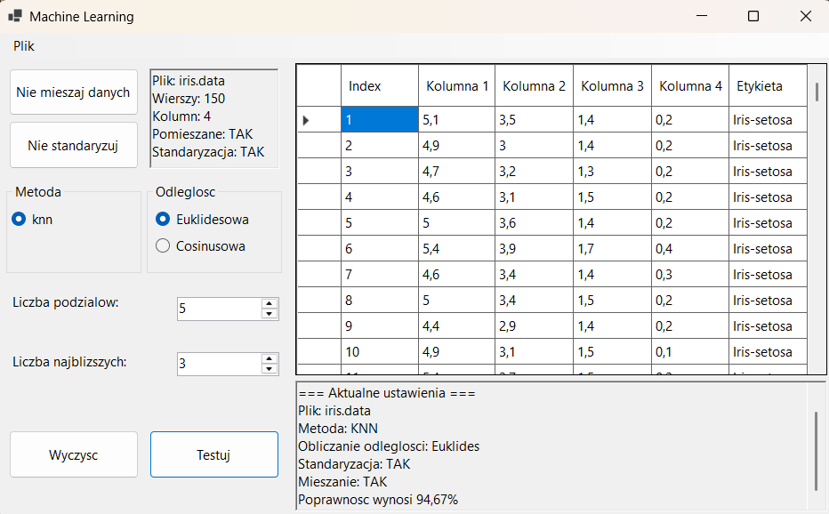

# KNN Machine Learning

## Przegląd projektu

Jest to aplikacja Windows Forms napisana w języku C#, która implementuje algorytm K-Najbliższych Sąsiadów (KNN) do klasyfikacji danych. Projekt został zaprojektowany z myślą o zbiorze danych Iris, ale może być łatwo rozszerzony na inne problemy klasyfikacyjne. Aplikacja umożliwia wczytanie plików, wybór metryki odległości, standaryzację danych, mieszanie zbioru oraz ocenę modelu za pomocą walidacji krzyżowej.





## Funkcje

- Wczytywanie plików z cechami numerycznymi i etykietami klas
- Wizualizacja danych w siatce z formatowaniem
- Przetwarzanie wstępne:
  - Standaryzacja danych
  - Mieszanie danych dla lepszej walidacji
- Metryki odległości:
  - Odległość euklidesowa
  - Odległość cosinusowa
- Walidacja krzyżowa: K-krotna ocena modelu
- Interfejs graficzny: Intuicyjny GUI z informacjami zwrotnymi
- Raportowanie wyników: Dokładność klasyfikacji i logowanie procesu


## Implementacja techniczna


| Plik                | Opis                                                                 |
|---------------------|----------------------------------------------------------------------|
| `Data.cs`           | Wczytywanie danych, standaryzacja, mieszanie                        |
| `Euklides.cs`       | Implementacja metryki euklidesowej                                   |
| `Cosinus.cs`        | Implementacja metryki cosinusowej                                    |
| `IDistance.cs`      | Interfejs dla metryk odległości                                      |
| `Knn.cs`            | Klasyfikator K-Najbliższych Sąsiadów                                 |
| `IMachine.cs`       | Interfejs dla algorytmów klasyfikacji                                |
| `CV.cs`             | walidacja krzyżowa                                          |
| `Form1.cs`          | Logika interfejsu użytkownika                                        |
| `Form1.Designer.cs` | Projekt graficzny formularza Windows Forms                          |


## Rozszerzalność projektu

Projekt został zaprojektowany z użyciem interfejsów (`IMachine`, `IDistance`), co umożliwia łatwe dodawanie nowych trybów działania:

- Nowe algorytmy klasyfikacji: wystarczy zaimplementować interfejs `IMachine`
- Nowe metryki odległości: implementując `IDistance`

Dzięki temu aplikacja może być rozwijana jako platforma testowa dla różnych metod klasyfikacji i porównania ich skuteczności.


## Jak używać

1. Wczytaj dane: Menu „Plik → Otwórz” → wybierz plik
2. Przetwórz dane:
   - Kliknij „Standaryzacja” aby znormalizować dane
   - Kliknij „Mieszaj dane” aby je przetasować
3. Skonfiguruj algorytm:
   - Wybierz metrykę (Euklidesowa / Cosinusowa)
   - Ustaw wartość K (liczba sąsiadów)
   - Wybierz liczbę podziałów walidacji
4. Uruchom test: Kliknij „Testuj”
5. Zobacz wyniki: Panel wyników pokaże dokładność klasyfikacji


### Przykładowy plik: `iris.data`
```bash
5.1,3.5,1.4,0.2,Iris-setosa
6.4,3.2,4.5,1.5,Iris-versicolor
7.1,3.0,5.9,2.1,Iris-virginica
```
 